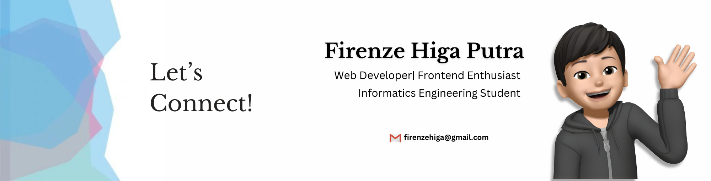

Hi there 👋 I'm Firenze Higa

Welcome to my GitHub profile!  
I'm passionate about web development, always eager to learn, and ready to make an impact as an team.

---

### 🚀 About Me
- 🌱 I am actively looking for an **internship opportunity** to grow my skills and contribute to real-world projects.
- 💻 My main stack: **PHP**, **Laravel**, **JavaScript**, **React.js**, and **Tailwind CSS**.
- 🤝 Comfortable working solo or as part of a team—adaptable to any environment.
- 🛠️ I love building both backend and frontend solutions, from robust APIs to beautiful user interfaces.
- 💬 Always ready to take on new challenges and learn new technologies.

    

### 👨‍💻 Tech Stack

    
    
    
    
    
    
    
    
    
    

### 🔗 Socials

  
  
  
  

 

---

### 📊 GitHub Stats

---

### 💼 Why Me?
- 📈 Fast learner, always up-to-date with the latest technologies.
- 🧩 Strong problem-solving skills and attention to detail.
- 🤲 Open-minded and collaborative—ready to work with diverse teams.
- 🌟 Genuine enthusiasm for building real products and making a difference.

---

### 📫 Let's Connect!
- Email: [firenzehiga@gmail.com](mailto:firenzehiga@gmail.com)
- LinkedIn: [linkedin.com/in/firenze-higa-putra](https://www.linkedin.com/in/firenze-higa-putra-286043290/)

---

_“Excited to contribute, learn, and grow as part of your team!”_

<!--
**firenzehiga/firenzehiga** is a ✨ _special_ ✨ repository because its `README.md` (this file) appears on your GitHub profile.
-->
